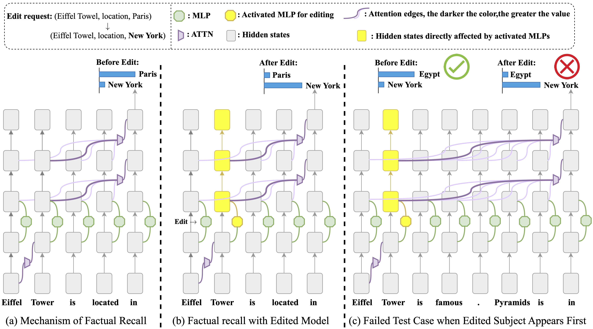
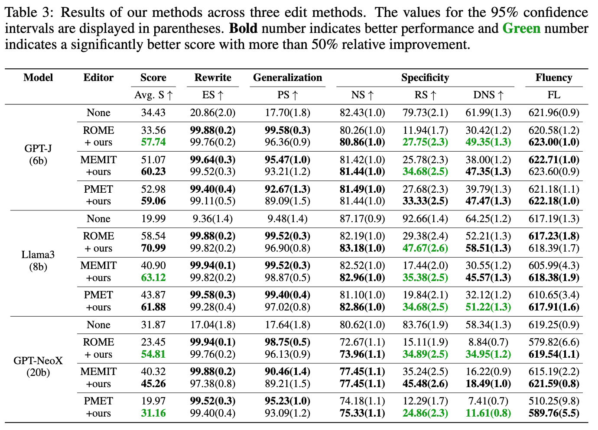

# Revealing and Mitigating Over-Attention in Knowledge Editing

This repository contains the official implementation of the paper ["Revealing and Mitigating Over-Attention in Knowledge Editing"](https://arxiv.org/abs/2502.14838).
The instructions for setting up and running the experiments described below. We also provide a demo on Colab for a quick understanding of the attention drift phenomenon in knowledge editing. Feel free to open an issue if you encounter any problems.  

[](https://colab.research.google.com/drive/1WjqxidJwC-HCgqrl70k_g61lQ-HPAycZ?usp=sharing)



## Requirements

To install the necessary dependencies, run the following command:

```bash
pip install -r requirements.txt
```

## Preparation

Before starting, you need to set up the required data and models:

1. **Download Status Data**: Fetch the dataset from ROME by downloading it to the `./data/status` directory from [here](https://rome.baulab.info/data/stats).

2. **Download Attribute Snippets**: Download `attribute_snippets.json` from [this link](https://rome.baulab.info/data/dsets/attribute_snippets.json) and place it in the `./data/status` directory.

3. **Set Up Pretrained Models**: Download the checkpoints for the pretrained model, for example, `meta-llama/Meta-Llama-3-8B`. Update the model paths in `./easyeditor/editors/easy_editor.py` to reflect where the models are stored on your system.

## Editing and Evaluation

To perform knowledge editing using our ADR method on the counterfact dataset, use the following commands:
The hyparams of all experiments are illustrated in out Appendix.

```bash
cd ./examples
bash scripts/rome.sh 
```

To get the metrics in our paper, run following instructions:
```bash
python summrize.py \
--metric accuracy \
--mode scores \
--base_path ./results/gpt-j-6B
```
The results will be shown in results.md.

## Results

Our model achieves impressive performance metrics, as shown in the figure below:


